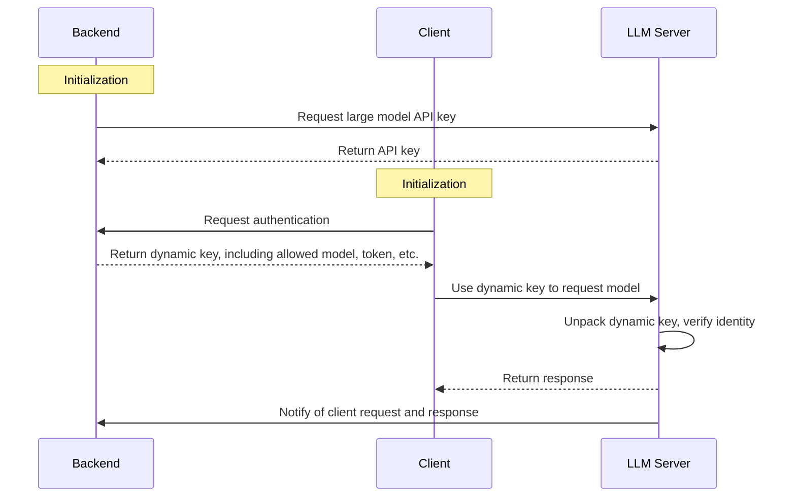

# Dynaseal

## Why this project was created

Imagine a future where LLM agents are widely deployed on edge devices. But currently, the way to call a large model is through an API key that anyone can use once they have it. What if users get the API key from the model on their device and can spam your services, skyrocketing your costs? If each user runs multiple agents on their phone, and you have a large user base, your servers could be overwhelmed, even worse than a DDoS attack! With DDoS, at least your service is disrupted, but in this case, your legitimate business is still running while your servers get flooded.

Thus, we propose [Dynaseal](https://github.com/IntelliKernel/Dynaseal), a future-oriented backend framework for managing LLM model calls from edge-side agents. It uses a dynamic token system similar to OSS, which restricts the models, parameters, and token lifetimes available to edge agents. It also supports direct communication between edge devices and large model service providers, and after each response, it triggers a callback to inform your backend of the transaction. We welcome any feedback and contributions; feel free to star our project!

> Please note that this project is just a demo. It implements our concept of dynamically distributing API keys for edge-side large model requests. The large model part is designed as a wrapper around an OpenAI-style large model server. On the client-side, we only implement basic integrity and parameter validation checks for keys. Callback functionality is limited to printing the results on the terminal.

## System Design

The architecture consists of three components: the LLM server, the backend, and the client.

1. The backend initializes by requesting the LLM server for an API key to access the large model.
2. The client initializes by requesting authentication from the backend. The backend returns a dynamic key specifying the model, token, request address, and other essential details.
3. The client uses the dynamic key to request the model from the LLM server.
4. The LLM server unpacks the dynamic key, verifies the identity, and returns a response.
5. The LLM server notifies the backend via a callback about the client’s request and the response.




## Dynamic Key Design

The dynamic key is designed as a JWT token in the format: `header.payload.secret`.

- **Header**
- **Payload**: First, a JSON object like the one below is created and packed into the JWT payload:

```json
{
  "api-key": 111, // The user ID registered by the backend on the LLM server. Note, it's the ID, not the key given by the LLM server.
  "model": "deepseek-chat", // The model name that the client is allowed to call
  "max_tokens": 100, // Maximum number of tokens that can be used
  "expiring": 111, // Expiration time using Unix timestamp
  "event_id": 111 // Event ID, used to identify this token. After the LLM server responds to the request, this ID will be included in the callback
}
```

- **Secret**: This is encrypted using the key that the backend registered with the LLM server, and the LLM server will use it to verify if the dynamic key is valid.

## Implementation Details

### Folder Structure

- **llm-server**: The large model backend, which functions as the server we typically use. It adds our design on top of regular API calls, implementing dynamic key verification and response handling.
- **backend**: The business backend, which provides services for companies or individuals who purchased large model API keys. It also handles client authentication and issues dynamic keys.
- **client**: The edge device running the agent.

### Database Creation

#### LLM Server

Create the following user in the `User` table. The user credentials are `user1:user1`:

```json
{
  "_id": {
    "$oid": "671249a93f1cf2f8bf9b2b82"
  },
  "api_keys": [
    {
      "_id": null,
      "revision_id": null,
      "api_key": "4d72c063-881f-45fa-85ab-3375c84f5dd7",
      "last_used": 0
    }
  ],
  "email": "user1@example.com",
  "password": "$2b$12$QFk6uHDBM5s69uSXrchivOC5SbpTUGV4tjmWz0nRvPSiMt.WAZVhC",
  "total_tokens": 0,
  "username": "user1",
  "callback_url": "http://127.0.0.1:9000/v1/callback/usage"
}
```

#### Business Backend

Create the following user in the `User` table. The user credentials are `client1:client1`:

```json
{
  "_id": {
    "$oid": "671247fadb2faa4fec2c6f39"
  },
  "api_keys": [],
  "email": "client1@example.com",
  "password": "$2b$12$fWy.Yjs9x5zSRirRibjliO4GX66GSO/.GuG7he9lIatuiNDoPPb9a",
  "username": "client1"
}
```

### Environment Variables

#### LLM Server

```
SECRET_KEY  // JWT secret
ALGORITHM  // JWT encryption algorithm
ACCESS_TOKEN_EXPIRE_MINUTES  // JWT access token expiration time
REFRESH_TOKEN_EXPIRE_MINUTES  // JWT refresh token expiration time
MONGODB_URL  // MongoDB URL
MONGODB_DB  // MongoDB database name
ADMIN_USER_PASSWORD  // Admin password
OPENAI_BASE_URL  // OpenAI base URL for wrapping
OPENAI_API_KEY  // OpenAI API key for wrapping
```

#### Business Backend

LLM_USER_ID is the user ID registered by the backend on the LLM server, and LLM_KEY is the key the backend obtained.

```
SECRET_KEY  // JWT secret
ALGORITHM  // JWT encryption algorithm
ACCESS_TOKEN_EXPIRE_MINUTES  // JWT access token expiration time
REFRESH_TOKEN_EXPIRE_MINUTES  // JWT refresh token expiration time
MONGODB_URL  // MongoDB URL
MONGODB_DB  // MongoDB database name
ADMIN_USER_PASSWORD  // Admin password
LLM_KEY = "4d72c063-881f-45fa-85ab-3375c84f5dd7"
LLM_USER_ID = "671249a93f1cf2f8bf9b2b82"
```

### API Agreements

- `llm_server_url`: http://127.0.0.1:8000
- `backend_url`: http://127.0.0.1:9000

- `backend_url/user/login`: User login
  - Data:
    - username
    - password
  - Response:
    - access_token: Token needed for subsequent interactions with the backend
    - refresh_token: Used to refresh the access token
    - token_type
- `backend/key/create`: Generate a dynamic key

  - Header:
    - bearer
  - Response:
    - token: The dynamic key used in the `dynasealtoken` header for LLM server requests

- `llm_server_url/client-side/chat/completions`: Request the large model. This request verifies client-side parameters, and inappropriate requests will trigger errors.

  - Header:
    - dynasealtoken
  - Body: Same format as OpenAI
  - Response: Same format as OpenAI

- `backend_url/callback/usage`: Callback interface, called after the LLM server processes the client request. The LLM server informs the backend about the request content and the tokens used.
  - event_id: The event ID from the dynamic key
  - content: The response content from the large model
  - tokens: The number of tokens consumed by the request

## How to Run the Project

1. Start the LLM server:

```
cd llm-server
python main.py
```

2. Start the business backend:

```
cd backend
python main.py
```

3. Run the client and check if the request is successful:

```
cd client
python request_side.py
```

If successful, the client terminal will display streaming output, and the backend terminal will print `event_id`, `content`, and `tokens`.

Client terminal:


Backend terminal:


## Unimplemented Features

- [ ] Callback requests stored in the database
- [ ] LLM server and backend registration
- [ ] ...
