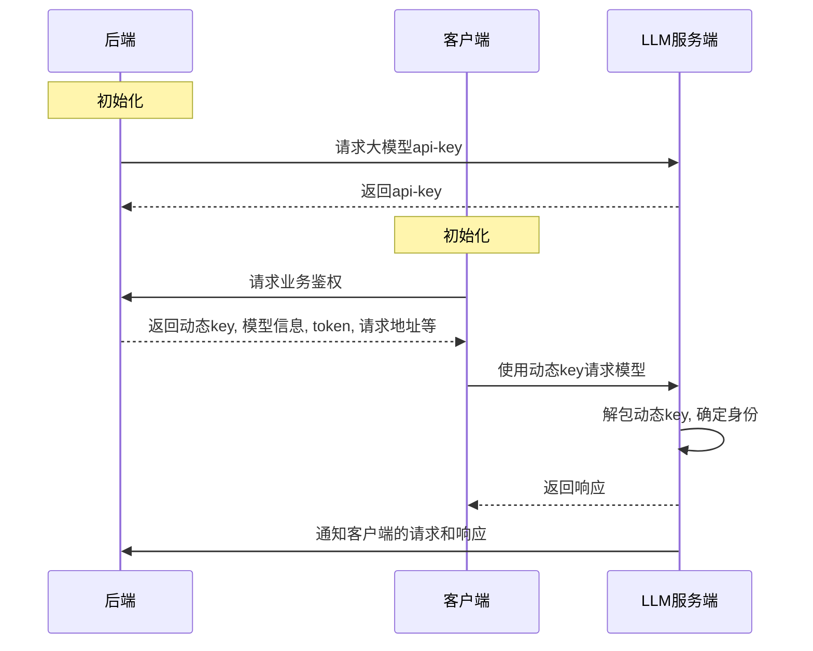

架构分为llm服务端，后端和客户端三部分。

1. 后端初始化，向llm服务端请求大模型api-key
2. 客户端初始化，向后端业务鉴权接口请求，通过后后端返回动态key, 指定模型，token, 请求地址和模型等基本信息。
3. 客户端使用动态key向大模型服务端请求模型
4. 大模型服务端解包动态key,确定身份后生成并返回响应
5. 大模型服务端通过后端的回调通知后端客户端的请求和响应

