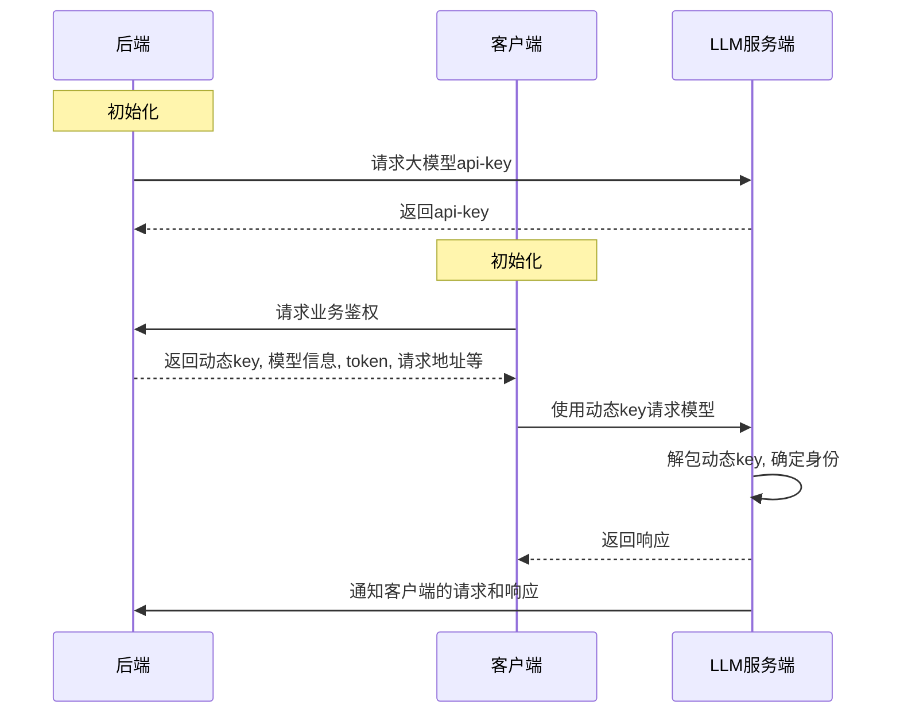

## 为什么要有这个项目

我们知道，现在调用大模型是申请一个 api key 来调用的，只需要拿着这个 key 就可以几乎随便用。那未来如果铺开 agent，很多 agent 是可以在客户端跑的，agent 也需要调用大模型。这种情况下，agent 的模型调用就有两种方式，一种是客户端与大模型服务端直接通信，一种是客户端与业务后端通信，后端和大模型服务端通信，这两种哪种会成为主流？如果是前者，是否需要一个动态的 api key 下发机制，就像 oss 一样？

## 系统设计

架构分为 llm 服务端，后端和客户端三部分。

1. 后端初始化，向 llm 服务端请求大模型 api-key
2. 客户端初始化，向后端业务鉴权接口请求，通过后后端返回动态 key, 指定模型，token, 请求地址和模型等基本信息。
3. 客户端使用动态 key 向大模型服务端请求模型
4. 大模型服务端解包动态 key,确定身份后生成并返回响应
5. 大模型服务端通过后端的回调通知后端客户端的请求和响应

```mermaid
sequenceDiagram
    participant 后端 as 后端
    participant 客户端 as 客户端
    participant LLM服务端 as LLM服务端

    Note over 后端: 初始化
    后端->>LLM服务端: 请求大模型api-key
    LLM服务端-->>后端: 返回api-key

    Note over 客户端: 初始化
    客户端->>后端: 请求业务鉴权
    后端-->>客户端: 返回动态key, 模型信息, token, 请求地址等

    客户端->>LLM服务端: 使用动态key请求模型
    LLM服务端->>LLM服务端: 解包动态key, 确定身份
    LLM服务端-->>客户端: 返回响应

    LLM服务端->>后端: 通知客户端的请求和响应

```
